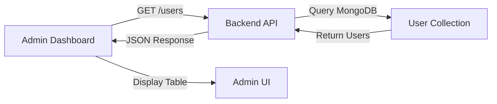
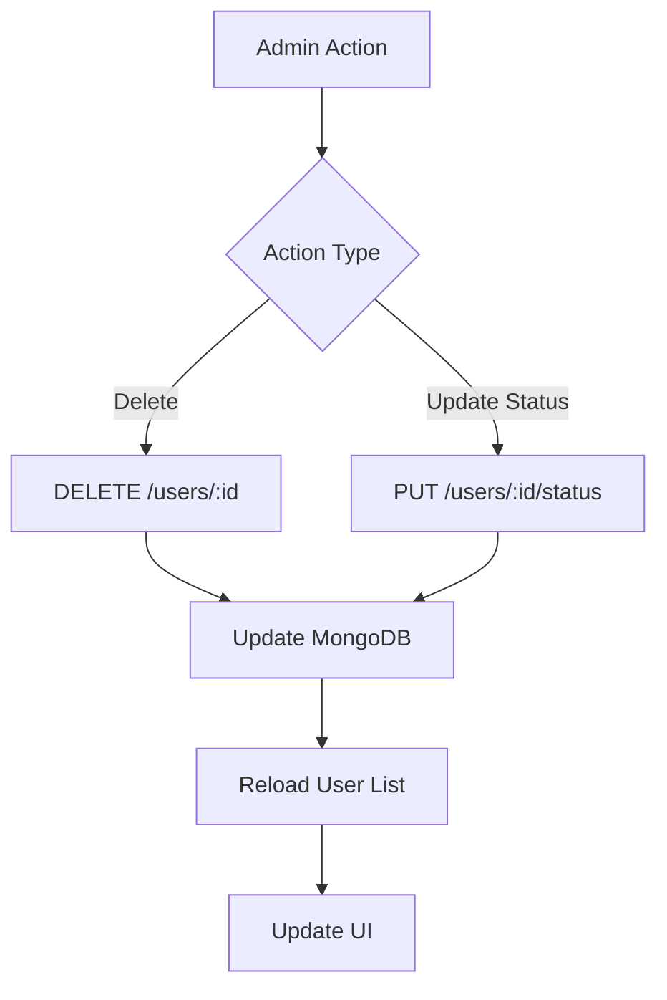

# Admin Dashboard - Real Data Integration Summary

## 🎯 Overview

The Admin Dashboard has been updated to display **real user data from MongoDB** instead of dummy/mock data. All user information is now fetched from the backend database and displayed in real-time.

---

## ✅ Changes Made

### 1. **Frontend Updates** (AdminDashboard.jsx)

#### Before:
- Used dummy data from `localStorage`
- Fake user statistics
- No real database integration

#### After:
- Fetches real users from MongoDB via API
- Calculates statistics from actual data
- Live updates when users are added/modified/deleted

**Key Changes:**
```javascript
// Real API integration
const response = await axios.get('http://localhost:5000/users');
const allUsers = response.data.users || [];

// Real delete operation
await axios.delete(`http://localhost:5000/users/${userId}`);

// Real status update
await axios.put(`http://localhost:5000/users/${userId}/status`, { status: newStatus });
```

---

### 2. **Backend Updates**

#### A. User Model (`backend/models/User.js`)
**Added Fields:**
- `status`: User account status (active, inactive, pending, suspended)
- `timestamps`: Automatic createdAt and updatedAt fields

```javascript
status: { type: String, enum: ['active', 'inactive', 'pending', 'suspended'], default: 'active' }
```

#### B. User Routes (`backend/routes/user.js`)
**New Admin Endpoints:**

| Method | Endpoint | Description |
|--------|----------|-------------|
| GET | `/users` | Fetch all users (returns array of user objects) |
| DELETE | `/users/:userId` | Delete a specific user (admin protection) |
| PUT | `/users/:userId/status` | Update user status |

**Security Features:**
- Cannot delete admin users
- Password fields are excluded from responses
- Status validation (only accepts valid values)

#### C. Server Configuration (`backend/server.js`)
**Added Route:**
```javascript
app.use("/users", userRoutes); // Admin route for fetching all users
```

---

## 📊 Data Flow

### User List Display


### User Operations


---

## 🔧 Setup Instructions

### 1. Start MongoDB
```bash
# Make sure MongoDB is running
mongod
```

### 2. Start Backend Server
```bash
cd "d:\Taxmate (2)\Taxmate\backend"
node server.js
```

### 3. Create Admin Account
```bash
cd "d:\Taxmate (2)\Taxmate\backend"
node setupAdmin.js
```

### 4. Start Frontend
```bash
cd "d:\Taxmate (2)\Taxmate\frontend"
npm run dev
```

### 5. Login as Admin
- Navigate to: `http://localhost:5173/login`
- Email: `admin@taxmate.com`
- Password: `Admin@123`
- Automatically redirected to: `http://localhost:5173/admin`

---

## 📈 Features Now Using Real Data

### ✅ Statistics Cards
- **Total Users**: Count from MongoDB
- **Total Revenue**: Calculated from user data (placeholder for future payment integration)
- **Tax Returns Filed**: Calculated from user data (placeholder for future tax submissions)
- **Growth Rate**: Calculated from historical data (currently static)

### ✅ User Management Table
- Real user names
- Real email addresses
- Actual registration dates (createdAt)
- Live status (active/inactive/pending/suspended)
- Admin role indication

### ✅ User Operations
- **View Details**: Shows real user information
- **Update Status**: Saves to database and updates UI
- **Delete User**: Removes from database (with admin protection)
- **Search**: Filters real user data by name/email
- **Filter**: Filters by actual user status

### ✅ Export Functionality
- Exports actual user data to CSV
- Includes real names, emails, status, and join dates

---

## 🔒 Security Implementations

1. **Admin Protection**
   - Admin users cannot be deleted
   - Only users with `isAdmin: true` can access admin dashboard
   - Non-admin users are redirected to `/user`

2. **Data Protection**
   - Password fields are never returned in API responses
   - User model uses `.select('-password')` in queries

3. **Validation**
   - Status values are validated (enum)
   - User existence is checked before operations

---

## 🧪 Testing Checklist

- [ ] MongoDB is running
- [ ] Backend server is running on port 5000
- [ ] Frontend is running on port 5173
- [ ] Admin account is created
- [ ] Can login as admin and see admin dashboard
- [ ] User list displays actual registered users
- [ ] Statistics show correct numbers
- [ ] Can search users by name/email
- [ ] Can filter users by status
- [ ] Can update user status (saves to DB)
- [ ] Can delete users (non-admin only)
- [ ] Export to CSV works with real data
- [ ] Regular users are redirected to `/user`

---

## 🚀 Next Steps (Future Enhancements)

1. **Revenue Tracking**
   - Add payment model
   - Link payments to users
   - Calculate actual revenue

2. **Tax Returns**
   - Create tax return model
   - Track submissions per user
   - Calculate accurate tax return counts

3. **Analytics**
   - Add time-based growth calculations
   - User registration trends
   - Activity logs

4. **Advanced Features**
   - User activity logs
   - Email notifications
   - Bulk operations
   - Advanced filtering
   - Data visualization charts

---

## 📝 Files Modified

### Frontend
- `frontend/src/pages/AdminDashboard.jsx` - Added real API integration
- `frontend/src/pages/Login.jsx` - Added role-based routing

### Backend
- `backend/models/User.js` - Added status field and timestamps
- `backend/routes/user.js` - Added admin endpoints
- `backend/routes/auth.js` - Returns isAdmin in login response
- `backend/server.js` - Added /users route
- `backend/setupAdmin.js` - Admin account creation script

### Documentation
- `backend/ADMIN_SETUP.md` - Updated with real data information
- `ADMIN_INTEGRATION_SUMMARY.md` - This file

---

## 💡 Tips

1. **First Time Setup**: Always run `setupAdmin.js` before trying to access admin dashboard
2. **Testing**: Create multiple test users through registration to see them in admin panel
3. **Debugging**: Check browser console and server logs for any API errors
4. **Data Refresh**: The admin dashboard loads data on mount and after each operation
5. **Status Changes**: Updates are immediate in the UI and saved to database

---

## ⚠️ Important Notes

- The admin dashboard requires both backend and frontend servers to be running
- MongoDB must be running and accessible
- Default admin credentials should be changed in production
- All API calls use `http://localhost:5000` - update for production deployment
- CORS is enabled for local development

---

## 📞 Support

If you encounter any issues:
1. Check that all services are running (MongoDB, Backend, Frontend)
2. Verify API endpoints are accessible
3. Check browser console for errors
4. Review server logs for backend errors
5. Ensure admin account was created successfully

---

**Last Updated:** 2025-10-25
**Version:** 1.0.0
