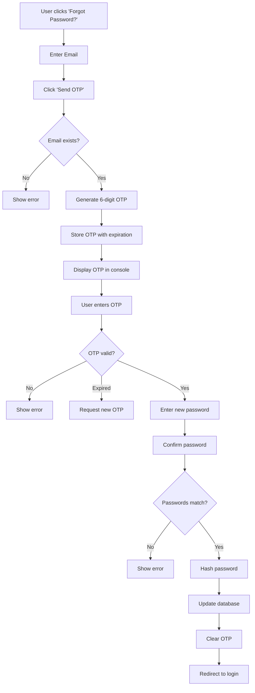

# Forgot Password Feature Documentation

## 🔐 Overview

The Forgot Password feature allows users to reset their password using a secure OTP (One-Time Password) verification process.

---

## ✨ Features

### **3-Step Password Reset Process**

1. **Request OTP**: User enters their email address
2. **Verify OTP**: User enters the 6-digit OTP sent to their email
3. **Reset Password**: User creates a new password

### **Security Features**

✅ 6-digit OTP generation
✅ 10-minute OTP expiration
✅ OTP verification before password reset
✅ Password hashing with bcrypt
✅ Email validation
✅ Resend OTP functionality

---

## 📁 Files Created/Modified

### **Frontend**
- ✅ `frontend/src/pages/ForgotPassword.jsx` - Main forgot password page
- ✅ `frontend/src/pages/Login.jsx` - Added "Forgot Password?" link
- ✅ `frontend/src/styles/login.css` - Added success message styling
- ✅ `frontend/src/App.jsx` - Added /forgot-password route

### **Backend**
- ✅ `backend/routes/auth.js` - Added 3 new endpoints:
  - POST `/forgot-password` - Request OTP
  - POST `/verify-otp` - Verify OTP
  - POST `/reset-password` - Reset password

---

## 🔄 User Flow



---

## 🚀 How to Use

### **For Users**

1. **Navigate to Login Page**: `http://localhost:5173/login`

2. **Click "Forgot Password?" link**

3. **Enter your email address** and click "Send OTP"

4. **Check the backend console** for the OTP (in development mode)
   ```
   =================================
   OTP for user@example.com: 123456
   Expires at: 12/25/2024, 10:45:00 AM
   =================================
   ```

5. **Enter the 6-digit OTP** and click "Verify OTP"

6. **Create a new password** and confirm it

7. **Click "Reset Password"** - You'll be redirected to login

---

## 🔧 API Endpoints

### **1. Request OTP**

```http
POST http://localhost:5000/forgot-password
Content-Type: application/json

{
  "email": "user@example.com"
}
```

**Response (Success):**
```json
{
  "message": "OTP sent to your email",
  "devOtp": "123456"  // Only in development mode
}
```

**Response (Error):**
```json
{
  "error": "No account found with this email address"
}
```

---

### **2. Verify OTP**

```http
POST http://localhost:5000/verify-otp
Content-Type: application/json

{
  "email": "user@example.com",
  "otp": "123456"
}
```

**Response (Success):**
```json
{
  "message": "OTP verified successfully"
}
```

**Response (Error):**
```json
{
  "error": "Invalid OTP. Please try again."
}
```

---

### **3. Reset Password**

```http
POST http://localhost:5000/reset-password
Content-Type: application/json

{
  "email": "user@example.com",
  "otp": "123456",
  "newPassword": "newSecurePassword123"
}
```

**Response (Success):**
```json
{
  "message": "Password reset successfully"
}
```

**Response (Error):**
```json
{
  "error": "Invalid OTP. Please try again."
}
```

---

## 🔒 Security Considerations

### **Current Implementation (Development)**
- OTPs are stored in memory (Map)
- OTPs are logged to console for testing
- 10-minute expiration time

### **Production Recommendations**

1. **Email Integration**
   - Install nodemailer: `npm install nodemailer`
   - Configure SMTP settings
   - Send OTP via email instead of console

2. **OTP Storage**
   - Use Redis for OTP storage
   - Or store in MongoDB with TTL index

3. **Rate Limiting**
   - Limit OTP requests per email (e.g., 3 per hour)
   - Prevent brute force attacks

4. **Additional Security**
   - Add CAPTCHA to prevent bots
   - Log password reset attempts
   - Send notification email after password change

---

## 📧 Email Integration (TODO)

To enable email sending in production:

### **1. Install Nodemailer**
```bash
cd backend
npm install nodemailer
```

### **2. Create Email Configuration**

Create `backend/config/email.js`:
```javascript
const nodemailer = require('nodemailer');

const transporter = nodemailer.createTransport({
  service: 'gmail', // or your email service
  auth: {
    user: process.env.EMAIL_USER,
    pass: process.env.EMAIL_PASSWORD
  }
});

const sendOTPEmail = async (email, otp) => {
  const mailOptions = {
    from: process.env.EMAIL_USER,
    to: email,
    subject: 'TaxMate - Password Reset OTP',
    html: `
      <h2>Password Reset Request</h2>
      <p>Your OTP for password reset is:</p>
      <h1 style="color: #6c5ce7; font-size: 32px;">${otp}</h1>
      <p>This OTP will expire in 10 minutes.</p>
      <p>If you didn't request this, please ignore this email.</p>
    `
  };

  await transporter.sendMail(mailOptions);
};

module.exports = { sendOTPEmail };
```

### **3. Update auth.js**

Replace console.log with:
```javascript
const { sendOTPEmail } = require('../config/email');

// In forgot-password route
await sendOTPEmail(email, otp);
```

### **4. Environment Variables**

Add to `.env`:
```env
EMAIL_USER=your-email@gmail.com
EMAIL_PASSWORD=your-app-password
```

---

## 🧪 Testing

### **Test Scenario 1: Successful Password Reset**
1. Register a user: `test@example.com`
2. Go to forgot password page
3. Enter email: `test@example.com`
4. Copy OTP from console
5. Enter OTP and verify
6. Set new password: `NewPassword123`
7. Login with new password ✅

### **Test Scenario 2: Invalid Email**
1. Enter non-existent email
2. Should show error: "No account found with this email address" ✅

### **Test Scenario 3: Expired OTP**
1. Request OTP
2. Wait 11 minutes
3. Try to verify
4. Should show error: "OTP has expired" ✅

### **Test Scenario 4: Invalid OTP**
1. Request OTP
2. Enter wrong OTP
3. Should show error: "Invalid OTP. Please try again." ✅

### **Test Scenario 5: Password Mismatch**
1. Complete OTP verification
2. Enter different passwords in new/confirm fields
3. Should show error: "Passwords do not match." ✅

---

## 📊 OTP Management

### **Current Storage**
```javascript
// In-memory Map
otpStore = {
  "user@example.com": {
    otp: "123456",
    expiresAt: 1703512800000
  }
}
```

### **Automatic Cleanup**
OTPs are automatically removed:
- After successful password reset
- When checking expiration (lazy deletion)

### **Manual Cleanup (Optional)**

Add to `server.js` for periodic cleanup:
```javascript
// Clean expired OTPs every 5 minutes
setInterval(() => {
  const now = Date.now();
  for (const [email, data] of otpStore.entries()) {
    if (now > data.expiresAt) {
      otpStore.delete(email);
      console.log(`Cleaned expired OTP for ${email}`);
    }
  }
}, 5 * 60 * 1000);
```

---

## 🎨 UI/UX Features

### **Frontend Features**
✅ 3-step wizard interface
✅ Loading states on all buttons
✅ Error and success messages
✅ Resend OTP functionality
✅ Password match validation
✅ Auto-redirect after success
✅ Back to login link
✅ Responsive design

### **User-Friendly Messages**
- "OTP sent to your email"
- "OTP verified successfully"
- "Password reset successfully! Redirecting to login..."
- "Invalid or expired OTP. Please try again."

---

## 🔍 Troubleshooting

### **Problem: OTP not showing in console**
**Solution:** Check backend terminal, not browser console

### **Problem: "Unable to connect to server"**
**Solution:** Ensure backend is running on port 5000

### **Problem: "OTP has expired"**
**Solution:** Request a new OTP (valid for 10 minutes only)

### **Problem: Password reset successful but can't login**
**Solution:** Make sure you're using the NEW password

### **Problem: "User not found" after OTP verification**
**Solution:** Database connection issue - check MongoDB

---

## 📝 Summary

The forgot password feature is now **fully functional** with:

✅ Secure OTP-based verification
✅ Email validation
✅ Password strength validation
✅ Expiring OTPs (10 minutes)
✅ Resend OTP functionality
✅ Beautiful UI with loading states
✅ Comprehensive error handling
✅ Ready for email integration

**Next Steps for Production:**
1. Integrate email service (Nodemailer)
2. Add rate limiting
3. Implement Redis for OTP storage
4. Add logging and monitoring
5. Enable CAPTCHA on request OTP

---

**Last Updated:** 2025-10-25
**Version:** 1.0.0
